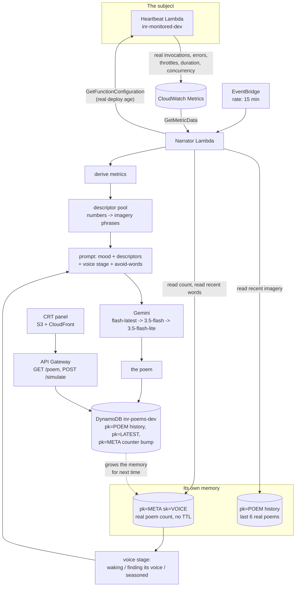

# Architecture

Four CDK stacks: `inr-dev-monitored` (the subject), `inr-dev-narrator` (the
observer + memory), `inr-dev-api` (read-only), `inr-dev-hosting` (the
panel). The interesting part isn't the stack count, it's the loop: a
Lambda watches another Lambda, and increasingly, watches its own past.

## Why this shape

- **The schedule is the author.** EventBridge, not a page load, decides
  when the machine speaks. The frontend only ever reads.
- **Memory is a separate, un-TTL'd counter.** The 7-day poem history exists
  for the frontend's "recent history" strip and can safely expire; the
  voice's sense of its own age must not reset with it, so `pk=META` never
  gets a TTL.
- **One read grant, added late.** The narrator originally only had write
  access to its own table (`grantWriteData`). Reading its own memory
  required widening that to `grantReadWriteData` - a real, one-line
  permission change, not a redesign.
- **`/simulate` is fenced separately.** It's the one route that can spend
  model quota on a visitor's click, so it gets its own cooldown and its
  own `pk=SIM` namespace, kept entirely out of the real history and out of
  the voice's memory of itself.

## AWS services in play

Lambda (heartbeat, narrator, read API, simulate), CloudWatch (the only
source of truth about the heartbeat's condition), EventBridge (the 15-min
schedule), DynamoDB (poems + voice memory), API Gateway (read + simulate),
Secrets Manager (the Gemini key), S3 + CloudFront (the panel).
